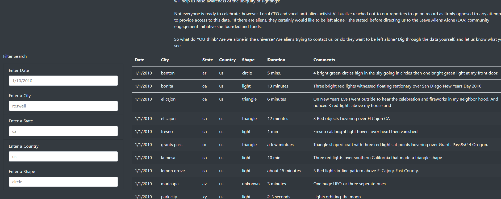
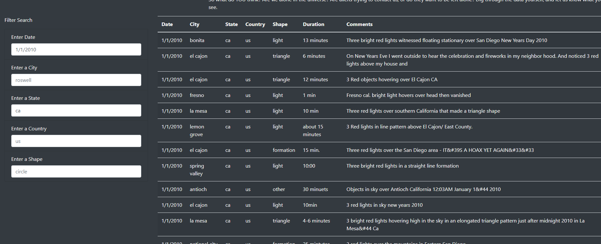

# UFOs

## Overview:
The purpose of this analysis was to create a website with UFO sighting information in a table which can also be filtered based on date, city, state, country and shap. The page was created using HTML, JavaScript and CSS.

## Results:

By default, the page will show the total UFO sighting information, as seen below.

After adding values in the available filters, in this case "1/1/2010" in the date field and "ca" in the state field, more specific results can be shown as seen below.

## Summary:
One current drawback is that the code does not filter according to capital letters, only lowercase letters.

One option for further development is the addition of more information such as maps to also show the density of UFOs appearing in any given areas.

Another is to include a date range in the filter options. As an example how this could help, if someone was to filter by a specific month, they could perhaps see if more UFO sigtings happens on specific days as well.
